# 桌面端音乐播放器 #

这是从去年11月份开始为了学习react做的一个音乐播放器，中间看了好多网上的资料，特别是[code-mcx](https://github.com/code-mcx/mango-music)他的使用Redux管理播放状态部分。这个版本算是我正式开音乐播放器的坑。
音乐播放器的音乐信息是拿[NeteaseCloudMusicApi](https://github.com/Binaryify/NeteaseCloudMusicApi)提供的网易云API接口。
在后期我加入了用户系统，拥有本地数据库，数据库是使用MySQL，然后也参照[NeteaseCloudMusicApi](https://github.com/Binaryify/NeteaseCloudMusicApi)的项目，使用koa2通过自己的后端调用网易云的API。

#### 项目截图
----------------------------

因为不知道怎么描述，就直接上图了，部分UI还有界面还没实现，当然结构上也存在一点问题。先记录，督促自己后期修改

这是主页
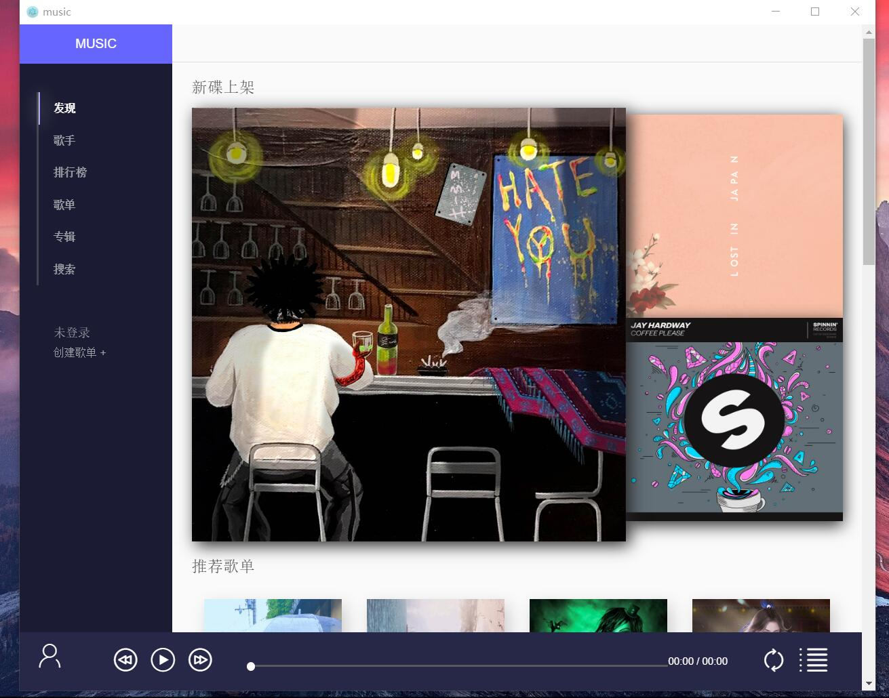

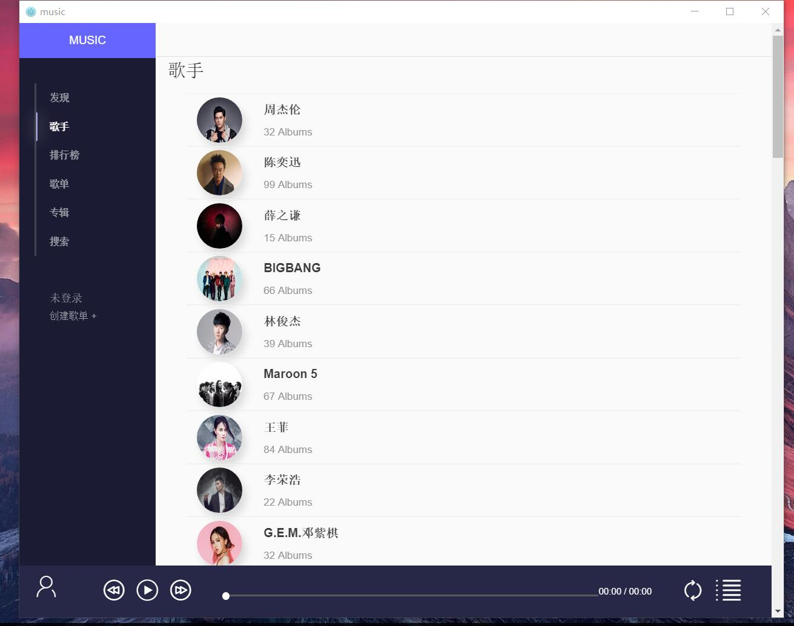
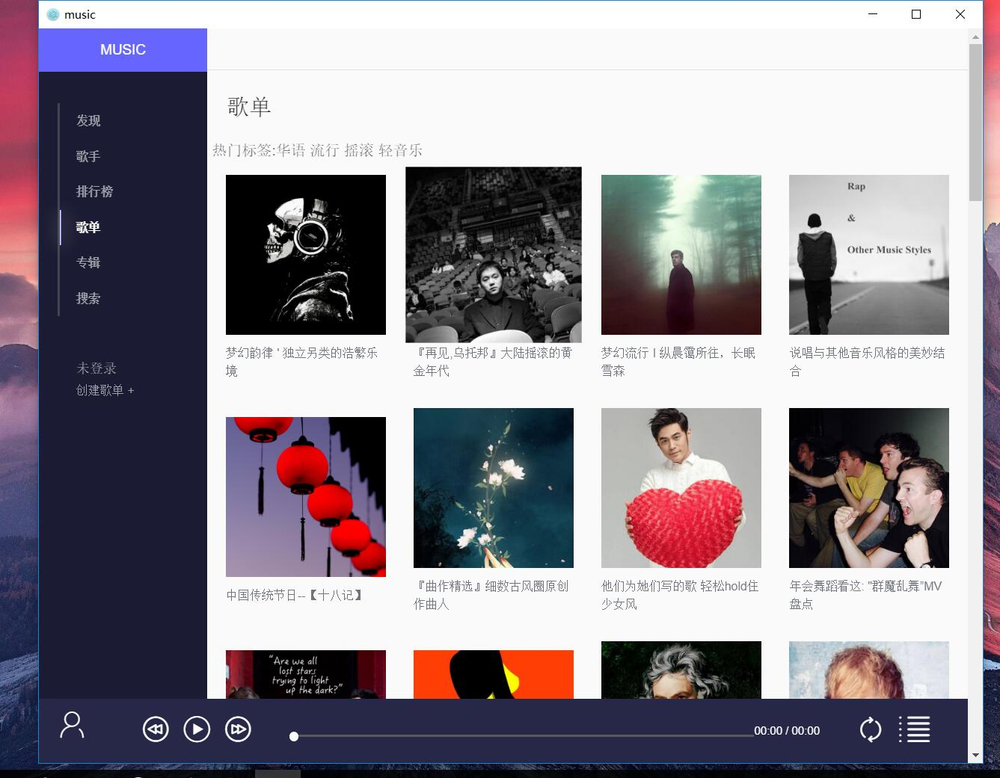
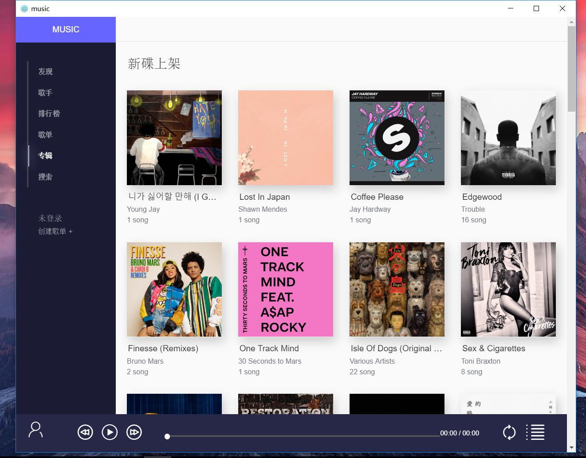
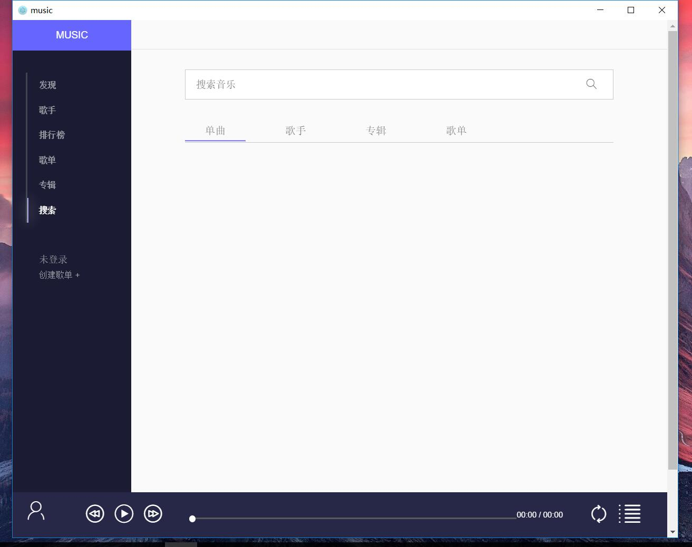
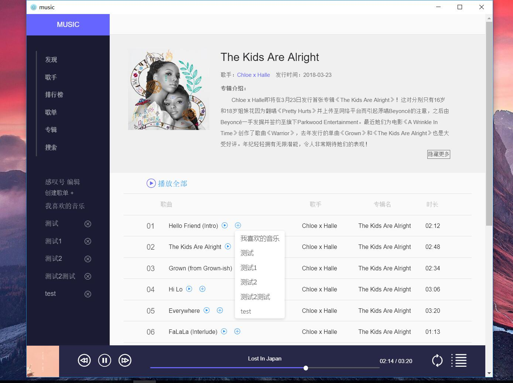
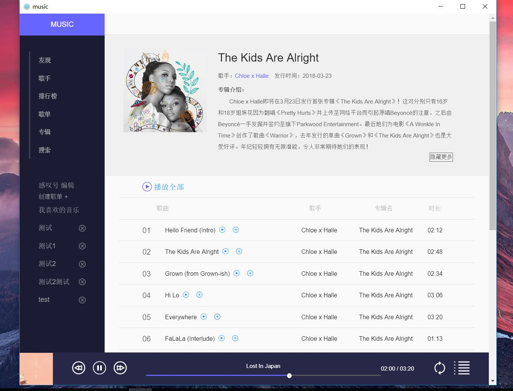
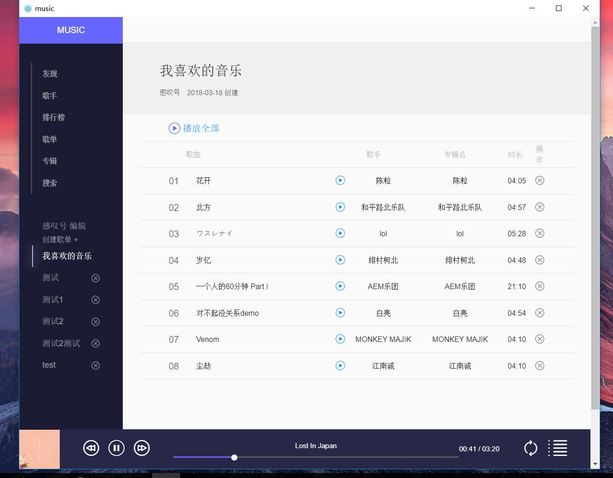
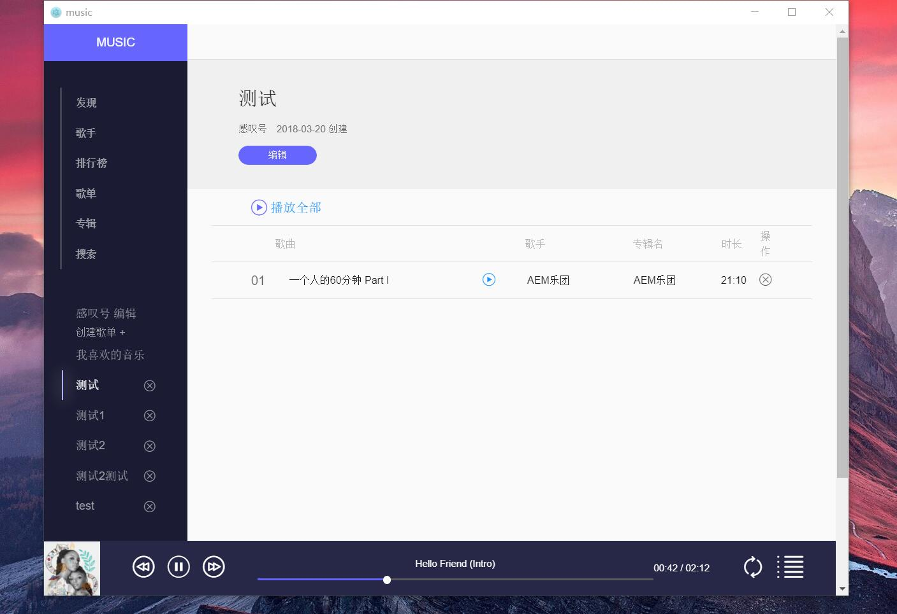
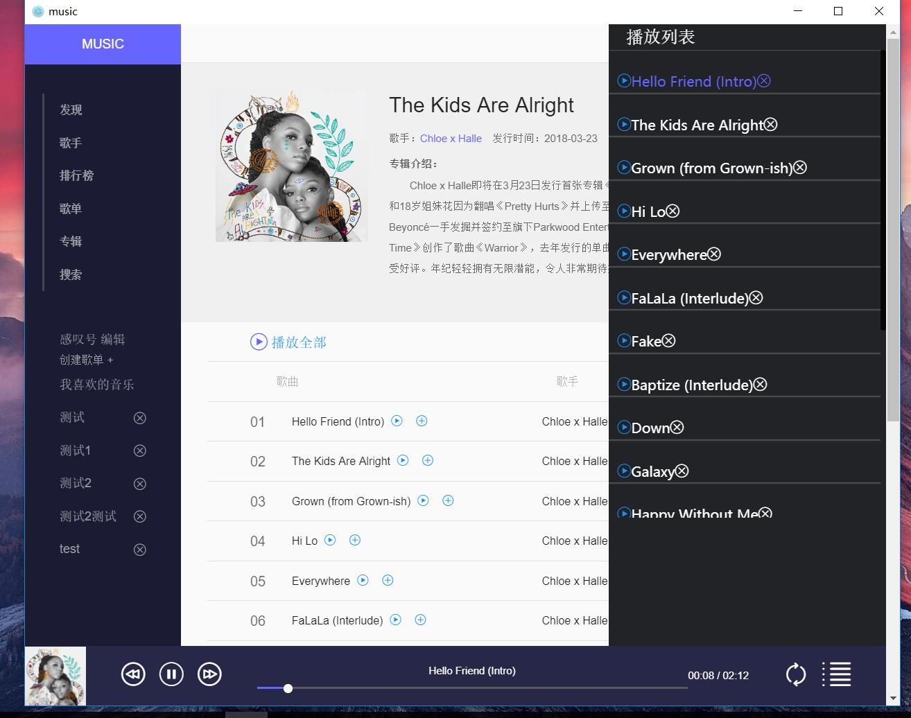
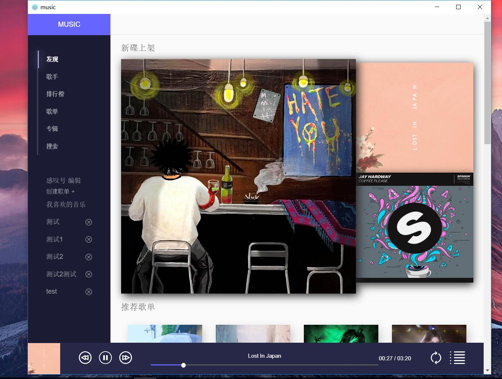
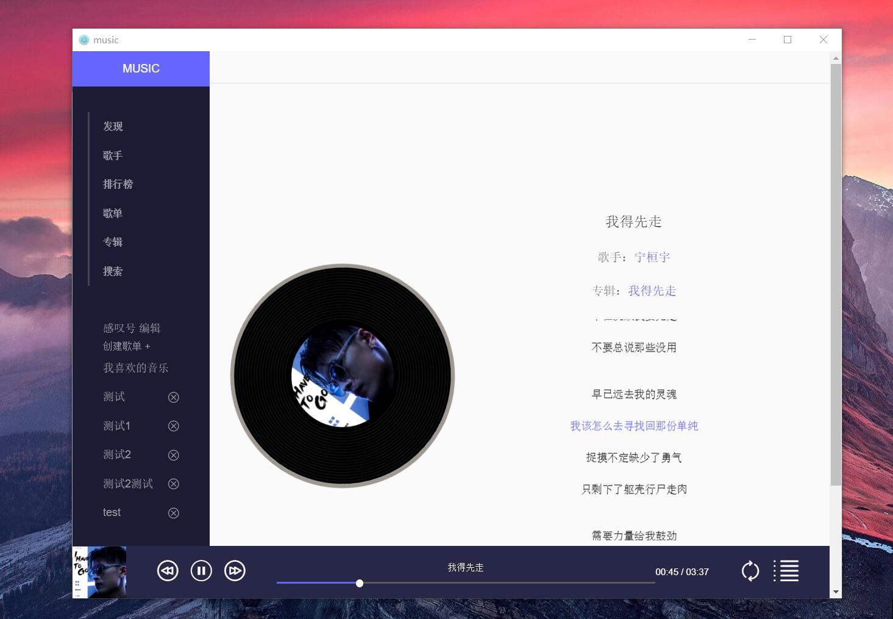

